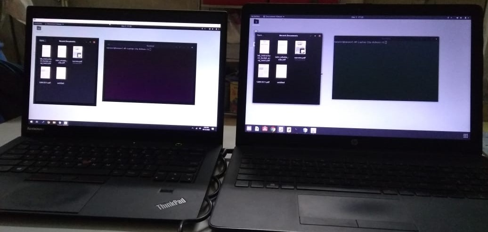

# Remote Desktop Application
 
# Project Description
* Remote Desktop Application is a software that allows a user to connect to a computer in another location, interacting as if they were locally connected. 
* It is able to control the server-side screen as well. Allowing the client to use various features of the software will be in the hands of the server.

# Requirements for implementation:
* JDK 1.5 (JRE 1.5) or above
* A desktop environment : Windows, Unix/LINUX ... etc.
* NetBeans 8.3 or above

# Code description: 
* Written in JAVA

# Installation:
git clone https://github.com/manasvi89/Remote-Desktop-Application \
$ cd ../path/to/the/file

# How to use:
* Open Project in NetBeans
* Open CN_Lab_Project_RDP/server/server.java and make sure socket port and ip addresses are proper
* Open CN_Lab_Project_RDP/client/clientfirstpage.java and check it has similar ports and socket ip as server
* Run server.java file, then run clientfirstpage.java
* If connection is successfull then you will be able to use every functionality

# Features:
* Screen sharing
* File transfer
* Chat or messaging

# image

  

